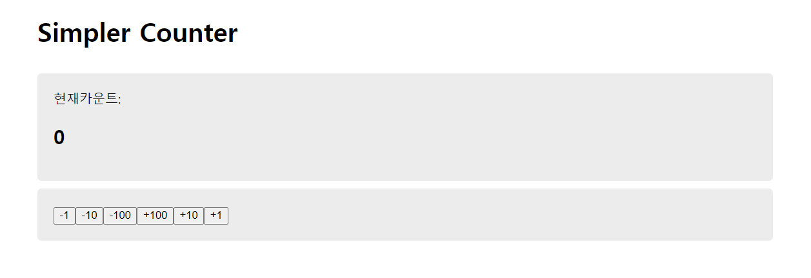

# 🔢 Simple Counter



```
📦src
 ┣ 📂assets
 ┣ 📂components
 ┃ ┣ 📜Header.css
 ┃ ┣ 📜Header.jsx
 ┃ ┣ 📜Main.css
 ┃ ┗ 📜Main.jsx
 ┣ 📜App.css
 ┣ 📜App.jsx
 ┣ 📜index.css
 ┗ 📜main.jsx
```

App에서 count를 관리해줄 state객체를 하나 생성한다.
그리고 props로 Main에게 count를 전달해준다.

Main에서는 숫자와 버튼들이 렌더링 된다.
숫자는 count를 렌더링 시키면 되고, 버튼이 클릭되면 해당 버튼의 숫자 만큼 숫자가 갱신되야 한다.
따라서 count가 업데이트 될 수 있도록 setCount가 필요한데 이를 props로 전달하지 않고, App에서 count를 업데이트 시키는 함수를 전달하기로 한다.

### 1. 버튼을 클릭했을 때 count를 갱신시켜주는 함수를 미리 만들어서 props로 전달

```javascript
// App.jsx
  const onClickButton = (num) => {
    setCount(count+num)
  }
```

```javascript
// Main.jsx
import './Main.css'

const Main = ({count, onClickButton}) => {

  return (
    <main className="Main">
      <section className="count-section">
        <div>현재카운트:</div>
        <h2>{count}</h2>
      </section>

      <section className='button-section'>
        <button onClick={()=>onClickButton(-1)}>-1</button>
        <button onClick={()=>onClickButton(-10)}>-10</button>
        <button onClick={()=>onClickButton(-100)}>-100</button>
        <button onClick={()=>onClickButton(100)}>+100</button>
        <button onClick={()=>onClickButton(10)}>+10</button>
        <button onClick={()=>onClickButton(1)}>+1</button>

      </section>
    </main>
  )
}

export default Main
```

onClickButton(num)은 setCount(count+num)을 return 시키므로 onClick={()=>onClickButton(num)}이런식으로 함수 형태로 onClick를 만들어 주어야 한다.


### 2. (다른 방법) setCount를 props로 컴포넌트에게 전달

```javascript
// Main.jsx
import './Main.css'

const Main = ({count, setCount}) => {

  return (
    <main className="Main">
      <section className="count-section">
        <div>현재카운트:</div>
        <h2>{count}</h2>
      </section>

      <section className='button-section'>
        <button onClick={()=>setCount(count-1)}>-1</button>
        <button onClick={()=>setCount(count-10)}>-10</button>
        <button onClick={()=>setCount(count-100)}>-100</button>
        <button onClick={()=>setCount(count+100)}>+100</button>
        <button onClick={()=>setCount(count+10)}>+10</button>
        <button onClick={()=>setCount(count+1)}>+1</button>
      </section>
    </main>
  )
}

export default Main
```

state를 갱신시키기 위해

1. 버튼을 클릭했을 때 count를 갱신시켜주는 함수를 미리 만들어서 props로 전달
2.  setCount를 props로 컴포넌트에게 전달

두가지 방법을 사용해 보았다.

둘을 비교해 보았을 때 setCount를 컴포넌트에게 props로 전달하는 것이 더 간단하게 느껴졌다. 하지만 onClickButton이라는 함수를 만들어 전달하면 더 직관적으로 어떤 함수인지 느낌이 오기때문에 코드 해석 측면에서 더 깔끔하게 느껴진다.

