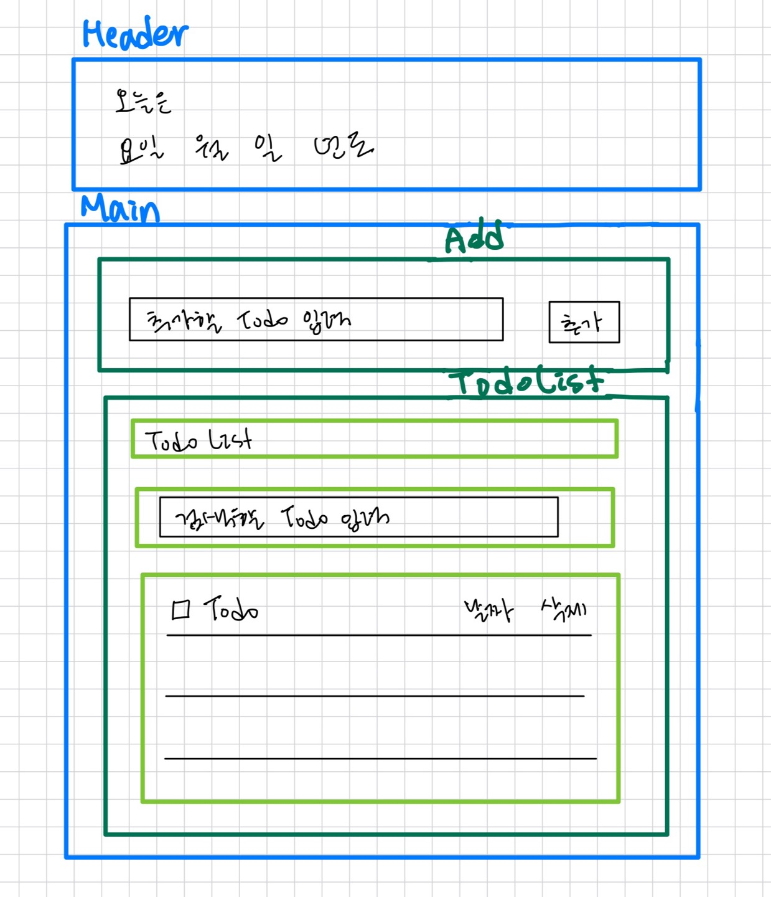
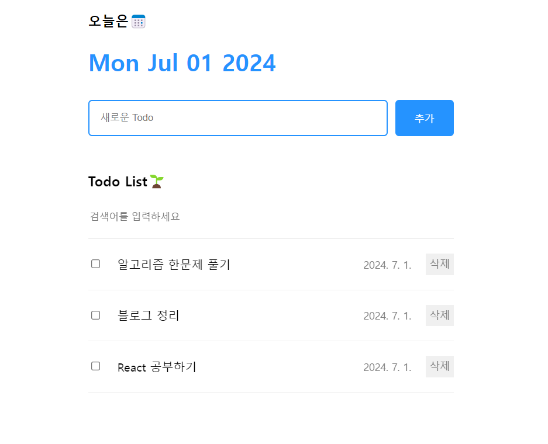

# 📒 Todo List

## 기획



## 프로젝트 구조
```
📦src
 ┣ 📂assets
 ┣ 📂components
 ┃ ┣ 📂Main
 ┃ ┃ ┣ 📜Add.css
 ┃ ┃ ┣ 📜Add.jsx
 ┃ ┃ ┣ 📜TodoList.css
 ┃ ┃ ┣ 📜TodoList.jsx
 ┃ ┃ ┣ 📜TodoListItem.css
 ┃ ┃ ┗ 📜TodoListItem.jsx
 ┃ ┣ 📜Header.css
 ┃ ┣ 📜Header.jsx
 ┃ ┣ 📜Main.css
 ┃ ┗ 📜Main.jsx
 ┣ 📜App.css
 ┣ 📜App.jsx
 ┣ 📜index.css
 ┗ 📜main.jsx
```


## 과정
Header에서는 오늘의 날짜가 렌더링 된다. 그리고 Main에는 할일을 추가할 수 있는 Add컴포넌트와 할일들의 목록을 보여주는 TodoList컴포넌트로 구성되어 있다.

### 1. useReduce로 상태관리

```javascript
import './App.css'
import Header from './components/Header'
import Main from './components/Main'
import { useReducer, useRef } from 'react'

const mockData = []

function reducer(todos, action) {
  switch(action.type) {
    case 'CREATE':
      return [action.data, ...todos]
    case 'UPDATE':
      return todos.map((todo) => todo.id === action.targetId ? {...todo, isDone: !todo.isDone} : todo)
    case 'DELETE':
      return todos.filter((todo) => todo.id !== action.targetId)
    }
}

function App() {
  const [todos, dispatch] = useReducer(reducer, mockData)
  const newId = useRef(0)

  const onCreate = (content) => {
    dispatch({
      type: 'CREATE',
      data: {
        id: newId.current++,
        isDone: false,
        content: content,
        date: new Date().getTime()
      }
    })
  }

  const onUpdate = (targetId) => {
    dispatch({
      type: 'UPDATE',
      targetId: targetId
    })
  }

  const onDelete = (targetId) => {
    dispatch({
      type: 'DELETE',
      targetId: targetId
    })
  }

  return (
    <div className='App'>
      <Header />
      <Main onCreate={onCreate} onDelete={onDelete} onUpdate={onUpdate} todos={todos} />
    </div>
  )
}

export default App
```

### 2. (다른 방법) useState로 상태관리

```javascript
// App.jsx
import './App.css'
import Header from './components/Header'
import Main from './components/Main'
import { useState, useReducer, useRef } from 'react'

const mockData = []

function App() {
  const [todos, setTodos] = useState(mockData)
  const newId = useRef(0)

  const onCreate = (item) => {
    const newTodo = {
      id: newId.current++,
      isDone: false,
      content: item,
      date: new Date().getTime()
    }

    setTodos([
      newTodo,
      ...todos
    ])
  }

  const onUpdate = (targetId) => {
    setTodos(todos.map((todo) => todo.id === targetId ? { ...todo, isDone: !todo.isDone } : todo))
  }

  const onDelete = (targetId) => {
    setTodos(todos.filter((todo) => todo.id !== targetId))
  }

  return (
    <div className='App'>
      <Header />
      <Main onCreate={onCreate} onDelete={onDelete} onUpdate={onUpdate} todos={todos} />
    </div>
  )
}

export default App
```


## 결과물



## 느낀점
useState로 상태관리를 하면 setTodos는 컴포넌트 안에서 사용할 수 있어서 onCreate, onUpdate, onDelete 모두 App컴포넌트 안에서 함수를 작성해 주어야 한다. 

useState대신에 useReduce를 쓰면 상태관리함수를 밖에서 하나로 묶어서 정의할 수 있어서 상태 관리에 관한 코드 해석이 더 쉽다. 또한 App컴포넌트 안의 코드 길이가 짧아져서 App이 렌더링 되는 것들을 파악하기 편하다.

